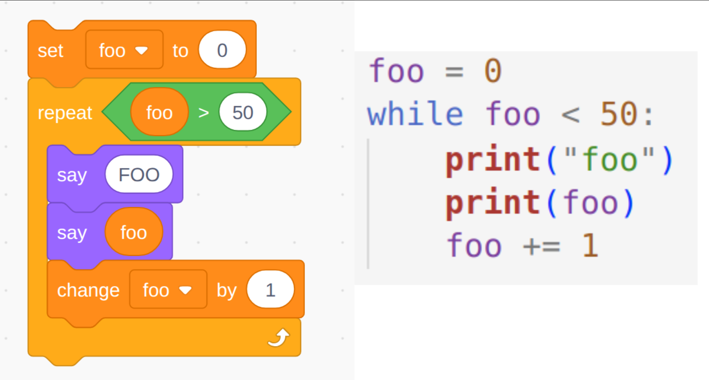

## Background & Inspiration

Invented in 2003 scratch is a programming language intended for children ages 10 - 15. The intent of this project was to model programming concepts via large colorful blocks, to teach children the basics of programming. Scratch has since been a massive success, as of 2023 scratch go 95 million monthly visits, some fo those recurring users, other programming novices. 

This language was intended to model real world programming, whilst giving children a streamlined experience, free of the frustrating nature of learning to code. 

*Side by side comparison of scratch versus python*

Upon it's initial completion scratch had three defining features.
1. **The scratch compiler ALWAYS compiles** Scratch will never throw an exception or raise a ValueError, this was to shield novices from the frustration of syntax errors.
2. **Drag and Drop Blocks** Scratch is programmed through drag and drop blocks, allowing for novices to learn in a more intuitive way. As well as preventing students from copying and pasting answers
3. **Examples** Scratch comes preloaded with examples and tutorials, leading to a more streamlined experience.    

##  Project Goals & Summary
The goal of this project is to make a learning software for children and high schoolers to learn core data science concepts, such as overfitting, and linear vs non-linear models. 

I plan to do so using a "Drag and Drop" system, very similar to how scratch operates.

*A draft of the current drag and drop interface versus python code.*

This would allow students and novices to learn in a similar way to scratch. 

### Project sub-goals:
1. **Project always compiles** The project should either compile or not change. It should rarely throw an error. 
2. **Drag and drop datascience components** Drag and drop column values, as well as sklearn componets to build and AI model. 
3. **Examples** This software should have example datasets, and later linked tutorials to enhance learning. 
4. **Compatibility** This software should allow for the exporting and saving of data, so students can save their projects and share them (presumably with proud parents)


## Current works
Currently, there is still a lot to work on for this application, most of the core application features have been implemented, but there is still a lot of software development left to do. 


*Pre-UI/UX redesign Fall 2025*
## Running the current GUI
warning, this is a work in progress, and bugs are guaranteed!!!!

To run the GUI
```
source .venv/bin/activate
python3 main.py example_datasets/iris.csv
```
There are several other example csv's I have included, They are veiwable thru the "example_datasets" folder. 


